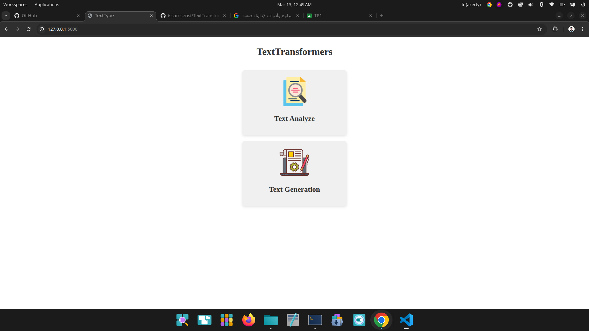
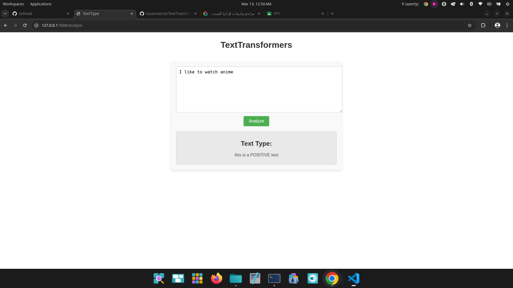
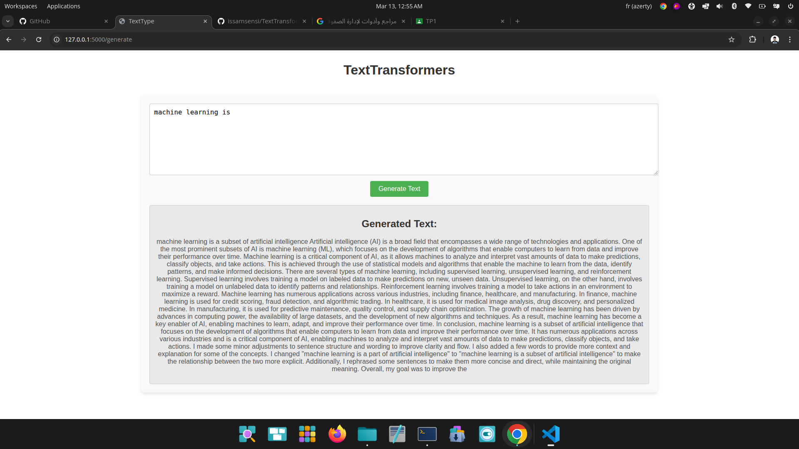

# TextType

A Flask web application that leverages Hugging Face Transformers to provide two core NLP features: **sentiment analysis** and **AI-powered text generation** — all through a clean, minimal browser interface.

---

## Features

- 🔍 **Text Analysis** — Detect whether a given text is `POSITIVE` or `NEGATIVE` using a pre-trained sentiment analysis model.
- ✍️ **Text Generation** — Continue or expand any prompt using a pre-trained language generation model (up to 500 new tokens).

---

## Tech Stack

| Layer      | Technology                        |
|------------|-----------------------------------|
| Backend    | Python, Flask                     |
| AI Models  | Hugging Face `transformers`       |
| Frontend   | HTML, CSS (Jinja2 templates)      |

---

## Project Structure

```
TextType/
├── app.py                  # Flask routes and app entry point
├── requerments.txt         # Python dependencies
├── static/
│   ├── images/             # UI icons
│   └── styles/             # Per-page CSS files
└── templates/
    ├── layout.html         # Base template
    ├── index.html          # Home page with feature cards
    ├── analyze.html        # Sentiment analysis page
    └── generate.html       # Text generation page
```

---

## Screenshots

### Home Page


### Text Analysis


### Text Generation


---

## Getting Started

### Prerequisites

- Python 3.8+
- pip

### Installation

1. **Clone the repository**
   ```bash
   git clone https://github.com/your-username/TextType.git
   cd TextType
   ```

2. **Create and activate a virtual environment** *(recommended)*
   ```bash
   python -m venv venv
   source venv/bin/activate
   ```

3. **Install dependencies**
   ```bash
   pip install -r requerments.txt
   ```

### Running the App

```bash
python app.py
```

Then open your browser and navigate to `http://127.0.0.1:5000`.

---

## Usage

### Home Page (`/`)
Displays two cards — one for **Text Analysis** and one for **Text Generation**. Click either to proceed.

### Text Analysis (`/analyze`)
1. Paste or type any text into the input field.
2. Click **Analyze**.
3. The app will display whether the text is `POSITIVE` or `NEGATIVE`.

### Text Generation (`/generate`)
1. Enter a prompt or partial sentence.
2. Click **Generate Text**.
3. The app will return an AI-generated continuation of your input.

---

## Notes

- Models are downloaded automatically on first use via the Hugging Face `transformers` library. An internet connection is required for the initial download.
- Default models used:
  - Sentiment Analysis: `distilbert-base-uncased-finetuned-sst-2-english`
  - Text Generation: `gpt2`

---

## License

This project is open-source and available under the [MIT License](LICENSE).

## Author

[Issam SENSI](https://github.com/issamsensi)

## Portfolio

[issamsensi.com](https://issamsensi.com)